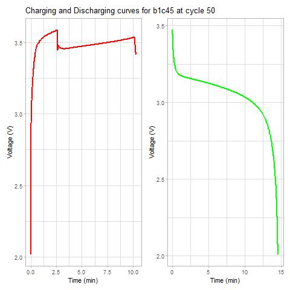
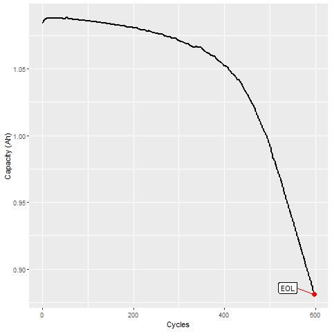
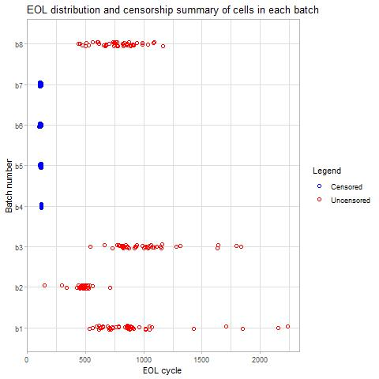
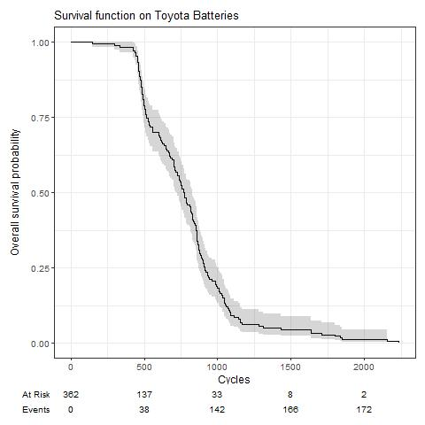

# survAn-batteries
A survival analysis approach on estimating the EOL probability for a group of 8 batchs of Toyota Li-ion batteries. In the code we have used the voltage charging curves as covariates and the methodology could be extended to the discharging voltage curves. 

## Data source
The cycling data on the 8 batches can be found at [https://data.matr.io/1/](https://data.matr.io/1/).

## EDA
The voltage charge and discharge curves on cell b1c45.

Capacity loss until EOL on a cell.

From the 8 batches, 4 were driven to the EOL (b1, b2, b3 and b8) and 4 were censored i.e. they left the experiment without arriving to EOL (b4, b5, b6 and b7). See the following figure (see Figure 3 in [1]).

We can plot the survival curve of the Toyota batteries according to the EOL indicator.

## Motivation
The use of Survival Analysis techniques on renewable resources was the main motivation. 

After some research we have found the paper [1], and we dediced to compare its results with respect to other Survival Analysis models. The comparison is made throgh the scores C-index, Integrated Brier Score and Integrated Cumulative AUC.

## Bibliography

[[1] Rasheed Ibraheem et al., Robust survival model for the prediction of Li-ion battery lifetime reliability and risk functions](https://www.pure.ed.ac.uk/ws/portalfiles/portal/489475390/main.04-REVISION-V2-MARKED.pdf)\
[[2] David Kuhajda, Using Survival Analysis to Evaluate Medical Equipment Battery Life](https://www.sciencedirect.com/science/article/pii/S0306261923013387)\
[[3] Rasheed Ibraheem et al., Early prediction of Lithium-ion cell degradation trajectories using signatures of voltage curves up to 4-minute sub-sampling rates](https://www.sciencedirect.com/science/article/pii/S0306261923013387)\
[[4] Attia Peter M. et al., Statistical Learning for Accurate and Interpretable Battery Lifetime Prediction](https://arxiv.org/abs/2101.01885)\
[[5] Attia Peter M. et al., Data-driven prediction of battery cycle life before capacity degradation](https://www.nature.com/articles/s41560-019-0356-8)\
